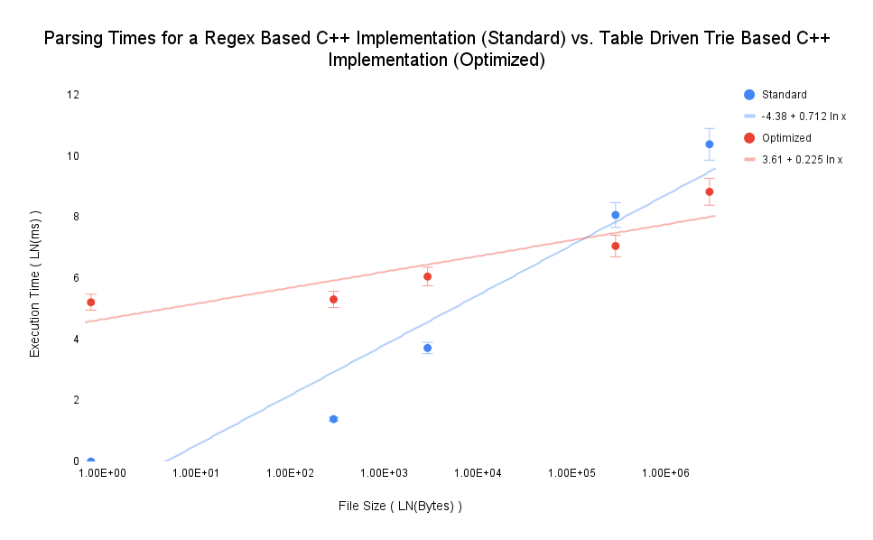

# Fast Data Processing Using Tries and State Machines

CS 547 High Performance Computing @ Binghamton University

release date 2024-02-11 ([piazza](https://piazza.com/class/lrkxtzhdnc831h/post/67))

## Standard Implementation

* The standard implementation uses the C++17 STL and Regexes to compute
  results. While convenient, the C++ stdlib can be slow at times.

## Optimized Implementation

* The optmized implementation uses a state machine for parsing and a table-driven
  trie for storage and comparison of parse results.

## Results

_Note: 3 runs per test file and approximated the execution speed._

| Lines                       | File Size                 | standard.cpp parser (s)    | optimized.cpp (ms)        |
|-----------------------------|---------------------------|----------------------------|---------------------------|
| <center>3</center>          | <center>76 B</center>     | <center>~1 ms</center>     | <center>183 ms</center>   |
| <center>1_000</center>      | <center>29 KB</center>    | <center>4 ms</center>      | <center>201 ms</center>   |
| <center>10_000</center>     | <center>290 KB</center>   | <center>41 ms</center>     | <center>424 ms</center>   |
| <center>1_000_000</center>  | <center>29 MB</center>    | <center>3_181 ms</center>  | <center>1_152 ms</center> |
| <center>10_000_000</center> | <center>289.7 MB</center> | <center>32_130 ms</center> | <center>6_793 ms</center> |



## Submission

* DEADLINE:
    * 2024-03-05 11:59PM ([piazza](https://piazza.com/class/lrkxtzhdnc831h/post/111))
    * ~~2024-03-03 11:59PM~~ ([piazza](https://piazza.com/class/lrkxtzhdnc831h/post/97))
    * ~~2024-02-29 11:59PM~~

## Execution

### Standard Implementation

To compile and execute the standard implementation:

```shell
make standard && ./build/standard test/data
```

### Optimized Implementation

To compile and execute the optimized implementation:

```shell
make optimized && ./build/optimized test/data
```

### Generate Test Data

A C++ program was provided by the professor to generate test data for our program.

* [assignment_2_gen.cc](https://cdn-uploads.piazza.com/paste/jzm3q3u8zkr2v1/459abbb60ec2ba06bfe3d7f9186d40bcd93636b523a27fb456ef6422c9ebe25f/assignment_2_gen.cc)

The same file was downloaded and added to this repo and renamed to [generate.cpp](./generate.cpp). To
generate a test file:

```shell
g++ -std=c++17 -o generate generate.cpp && lines= && ./generate "${lines}" > "data_${lines}"
```

For testing, testing data was redirected into [test/](./test). For further description, within
the test directory an extension was added to describe which implementation {.optimized, .standard}
generated the results.

## Source

* https://cs.binghamton.edu/~kchiu/cs447/assign/2/